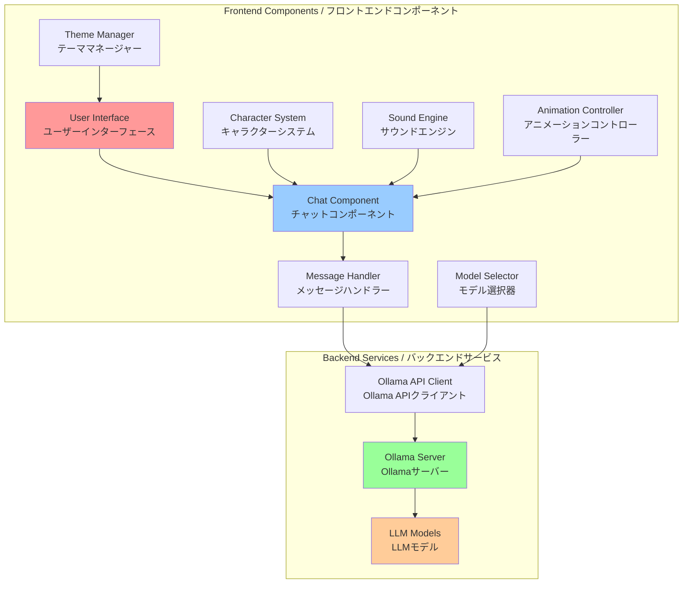
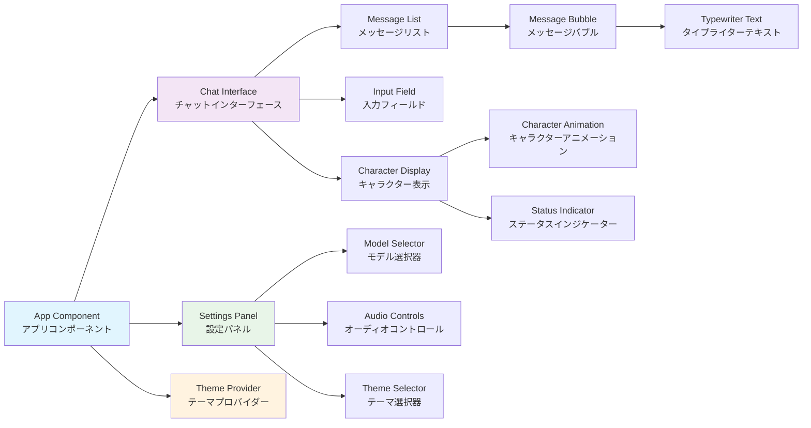
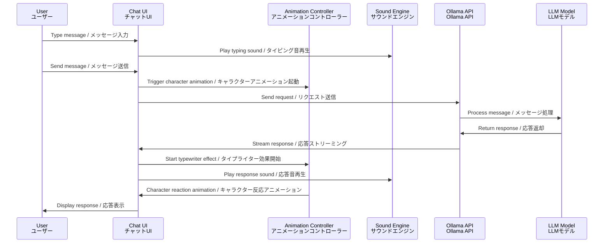

# llm-pixelchat / LLMピクセルチャット

A sophisticated pixel-art chatbot interface powered by Ollama LLMs, featuring visual character interfaces, model selection capabilities, and enhanced UI/UX with typewriter effects and sound effects.

Ollamaを利用したLLMベースの高度なピクセルアート風チャットボットインターフェース。ビジュアルキャラクターインターフェース、モデル選択機能、タイプライター効果と効果音を備えた拡張UI/UXを提供。

## Features / 機能

### Core Features / コア機能
- **Ollama Integration** / **Ollama連携**: Seamless connection to local Ollama LLM instances / ローカルOllama LLMインスタンスとのシームレス接続
- **Model Selection** / **モデル選択**: Dynamic switching between available Ollama models / 利用可能なOllamaモデル間の動的切り替え
- **Pixel Art UI** / **ドット絵UI**: Retro-styled pixel art interface with character animations / キャラクターアニメーション付きレトロ風ピクセルアートインターフェース
- **Visual Character Interface** / **ビジュアルキャラクターインターフェース**: Interactive character representations for different AI models / 異なるAIモデル用のインタラクティブキャラクター表現

### Enhanced User Experience / 拡張ユーザーエクスペリエンス
- **Typewriter Effect** / **タイプライター効果**: Character-by-character text animation for AI responses / AI応答のための文字単位のテキストアニメーション
- **Sound Effects (SE)** / **効果音**: Ambient typing sounds and interaction feedback / 環境タイピング音とインタラクション フィードバック
- **Responsive Design** / **レスポンシブデザイン**: Optimized for desktop and mobile devices / デスクトップとモバイルデバイス向けに最適化
- **Theme Support** / **テーマサポート**: Multiple visual themes and color schemes / 複数のビジュアルテーマとカラースキーム

## Technical Requirements / 技術要件

### Prerequisites / 前提条件
- **Ollama Server**: Running locally or accessible via network / ローカルまたはネットワーク経由でアクセス可能
- **Modern Web Browser**: Support for ES6+, WebSocket, Web Audio API / ES6+、WebSocket、Web Audio APIをサポート
- **Node.js**: Version 18+ for development environment / 開発環境用バージョン18+

### Dependencies / 依存関係
- **Frontend Framework**: React 18+ with TypeScript / TypeScriptを使用したReact 18+
- **State Management**: Context API or Redux Toolkit / Context APIまたはRedux Toolkit
- **WebSocket Client**: For real-time communication with Ollama / Ollamaとのリアルタイム通信用
- **Audio Library**: Web Audio API for sound effects / 効果音用Web Audio API
- **Animation Library**: CSS animations and/or Framer Motion / CSSアニメーションおよび/またはFramer Motion

## Architecture Overview / アーキテクチャ概要



## Component Architecture / コンポーネントアーキテクチャ



## Data Flow / データフロー



## Installation / インストール

### 1. Clone Repository / リポジトリクローン
```bash
git clone https://github.com/shotafujie/llm-pixelchat.git
cd llm-pixelchat
```

### 2. Install Dependencies / 依存関係インストール
```bash
npm install
# または / or
yarn install
```

### 3. Environment Setup / 環境設定
```bash
cp .env.example .env.local
# Edit .env.local with your Ollama server configuration
# Ollama サーバー設定で .env.local を編集
```

### 4. Start Development Server / 開発サーバー開始
```bash
npm run dev
# または / or
yarn dev
```

## Configuration / 設定

### Environment Variables / 環境変数
```bash
# Ollama server configuration / Ollama サーバー設定
NEXT_PUBLIC_OLLAMA_BASE_URL=http://localhost:11434
NEXT_PUBLIC_OLLAMA_MODEL=llama2

# UI/UX settings / UI/UX設定
NEXT_PUBLIC_TYPEWRITER_SPEED=50
NEXT_PUBLIC_ENABLE_SOUND=true
NEXT_PUBLIC_DEFAULT_THEME=retro
```

### Ollama Models / Ollamaモデル
Supported models include but are not limited to:
サポートされるモデルには以下が含まれますが、これに限定されません:

- `llama2` - Meta's LLaMA 2 model
- `codellama` - Code-focused LLaMA variant
- `mistral` - Mistral AI model
- `phi` - Microsoft Phi model
- `gemma` - Google Gemma model

## Usage / 使用方法

### Basic Chat / 基本チャット
1. Select your preferred model / 希望するモデルを選択
2. Type your message in the input field / 入力フィールドにメッセージを入力
3. Press Enter or click Send / Enterキーを押すか送信をクリック
4. Enjoy the typewriter effect and character animations / タイプライター効果とキャラクターアニメーションをお楽しみください

### Advanced Features / 高度な機能
- **Model Switching**: Change models mid-conversation / 会話中のモデル変更
- **Theme Customization**: Switch between visual themes / ビジュアルテーマの切り替え
- **Audio Controls**: Toggle sound effects on/off / 効果音のオン/オフ切り替え
- **Character Selection**: Choose different character avatars / 異なるキャラクターアバターの選択

## Development / 開発

### Project Structure / プロジェクト構造
```
llm-pixelchat/
├── src/
│   ├── components/           # React components / Reactコンポーネント
│   ├── hooks/               # Custom hooks / カスタムフック
│   ├── services/            # API services / APIサービス
│   ├── stores/              # State management / 状態管理
│   ├── styles/              # CSS/SCSS files / CSS/SCSSファイル
│   ├── types/               # TypeScript types / TypeScript型定義
│   └── utils/               # Utility functions / ユーティリティ関数
├── public/
│   ├── assets/              # Static assets / 静的アセット
│   ├── sounds/              # Audio files / オーディオファイル
│   └── characters/          # Character sprites / キャラクタースプライト
└── docs/                    # Documentation / ドキュメント
```

### Contributing / 貢献
1. Fork the repository / リポジトリをフォーク
2. Create a feature branch / 機能ブランチを作成
3. Commit your changes / 変更をコミット
4. Push to the branch / ブランチにプッシュ
5. Create a Pull Request / プルリクエストを作成

## License / ライセンス

This project is licensed under the MIT License - see the [LICENSE](LICENSE) file for details.

このプロジェクトはMITライセンスの下でライセンスされています - 詳細は[LICENSE](LICENSE)ファイルを参照してください。

## Acknowledgments / 謝辞

- **Ollama Team** for the excellent local LLM infrastructure / 優れたローカルLLMインフラストラクチャの提供
- **React Community** for the robust frontend framework / 堅牢なフロントエンドフレームワークの提供
- **Pixel Art Community** for inspiration and assets / インスピレーションとアセットの提供

## Support / サポート

For issues, questions, or contributions, please visit our [GitHub Issues](https://github.com/shotafujie/llm-pixelchat/issues) page.

問題、質問、または貢献については、[GitHub Issues](https://github.com/shotafujie/llm-pixelchat/issues)ページをご覧ください。
